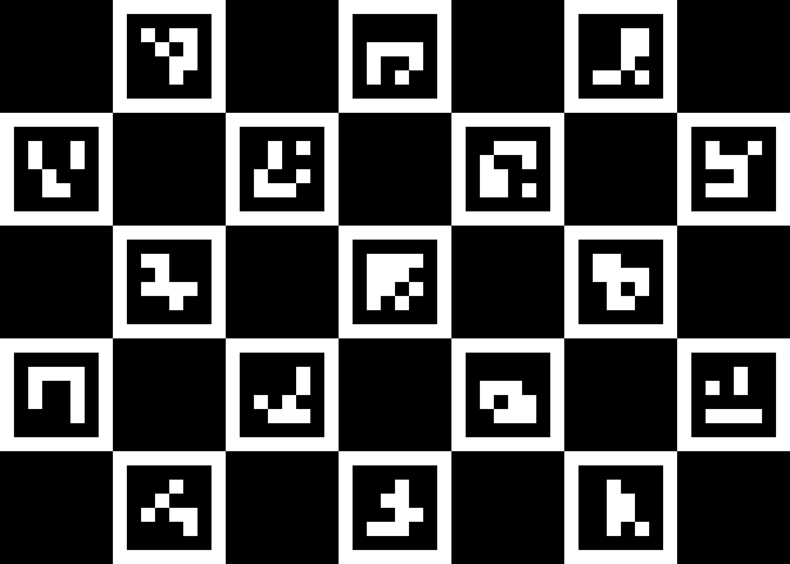
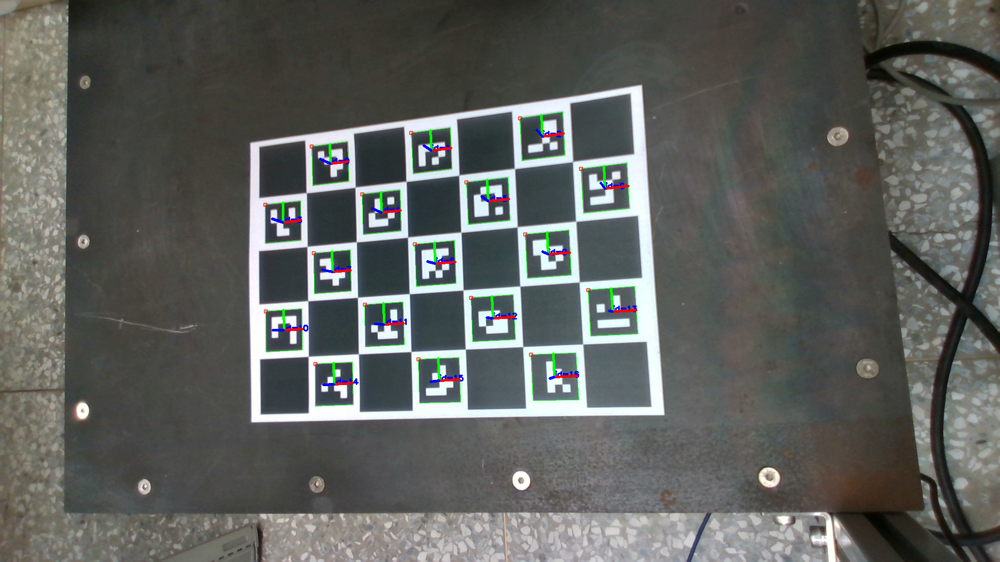
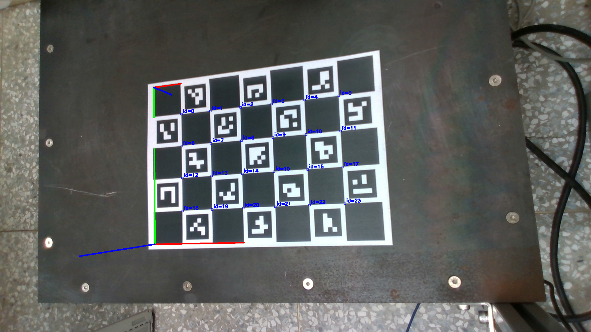
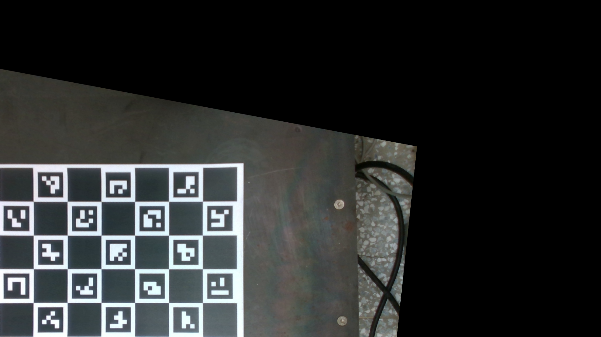
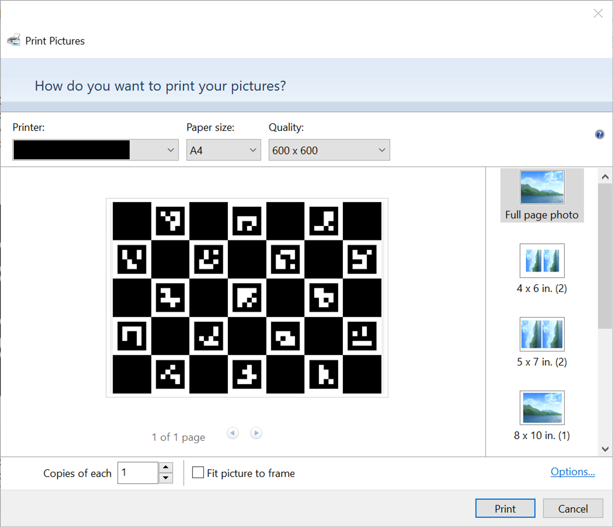
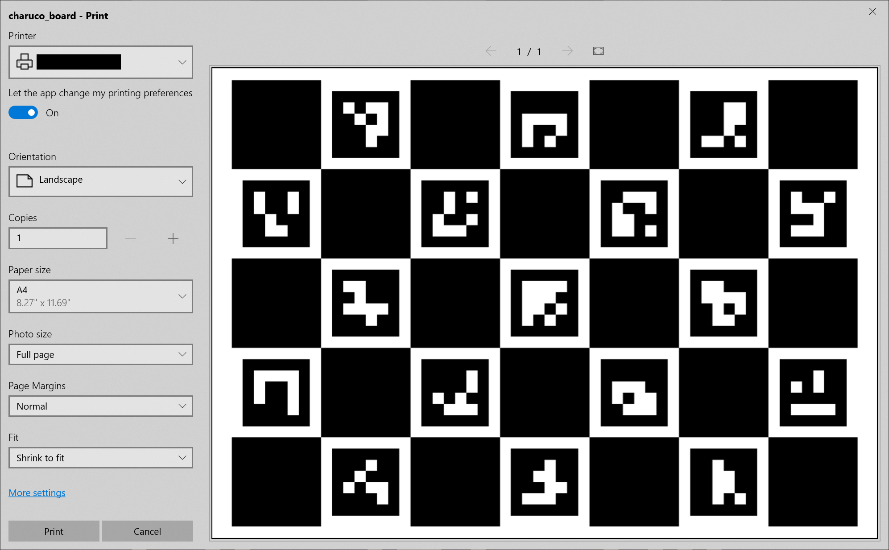

# charuco-pose-estimation
ChArUco pose estimation using OpenCV

1. 
1. Print out [charuco_board.png](charuco_board.png) and take a picture of it, name the picture [image.png](image.png). Make sure not to accidentally stretch the image during print.
1. Measure the actual square length and marker length of the printout, and change it in the code respectively
1. Create [intrinsic.txt](intrinsic.txt) with camera intrinsic matrix
1. Upload [image.png](image.png) and [intrinsic.txt](intrinsic.txt) to the current directory at the "Files" bar on the left
1. Click "Runtime" and "Run all" and see the output file [charuco_tf.txt](charuco_tf.txt) and [camera_tf.txt](camera_tf.txt) in the current directory

Create ChArUco

Detect markers

Detect ChArUco

Projection

## Printer settings for Windows

- Uncheck `Fit picture to frame`:

  

- Select `Shrink to Fit`:

  
